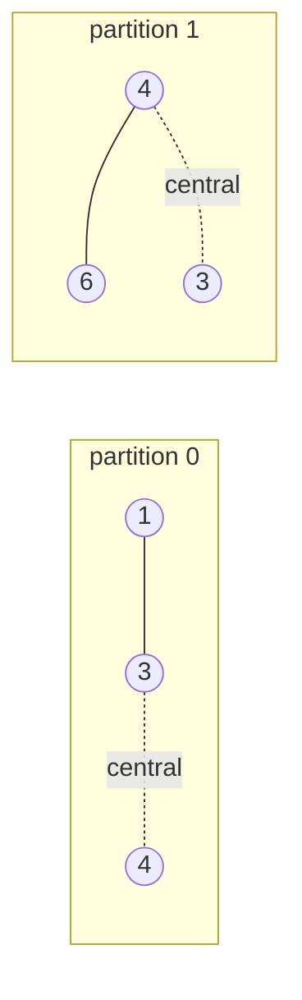
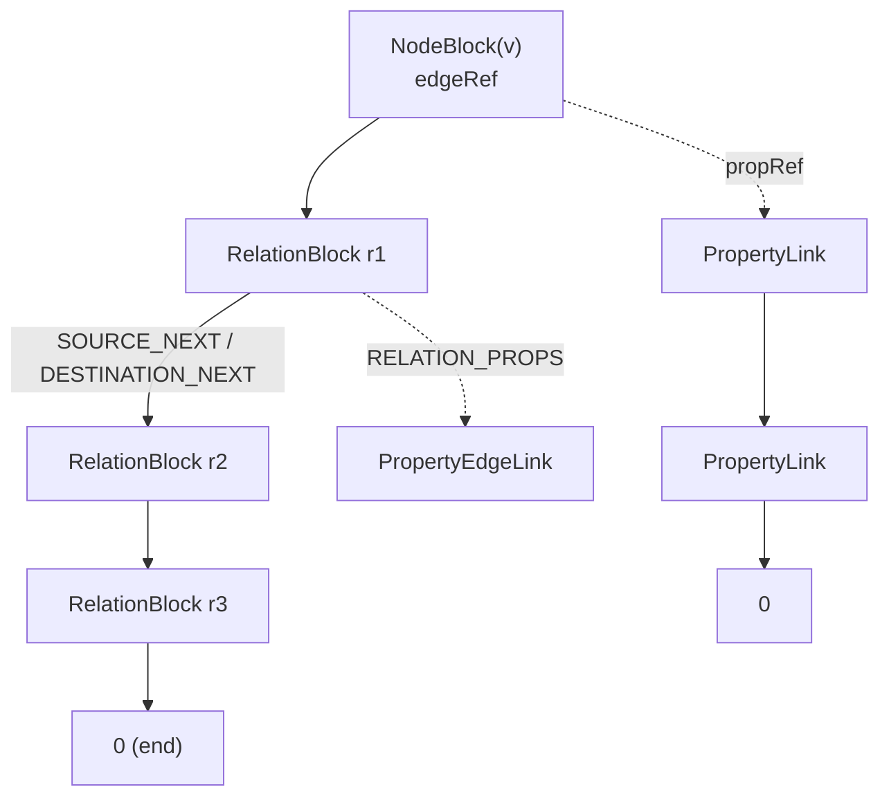
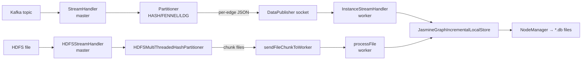

# JasmineGraph Native Store — Full Documentation

> Source of truth: `src/nativestore/` plus its callers in `src/localstore/incremental/`,
> `src/partitioner/stream/`, `src/util/kafka/`, `src/util/hdfs/`, `src/query/processor/cypher/runtime/`
> and `src/server/JasmineGraphInstanceService.cpp`.

---

## 1. What the native store is

The **native store** is JasmineGraph's on-disk, block-structured property-graph engine. It lives
**only on workers** (instances). One native store instance = **one graph partition**, i.e. the pair
`(graphID, partitionID)`.

It replaces the older hash-map based stores (`src/localstore/JasmineGraphHashMapLocalStore`,
`src/centralstore/JasmineGraphHashMapCentralStore`) which serialise whole adjacency maps as flat
files. The native store instead uses fixed-size binary records with pointer (byte-offset) chaining,
so nodes, edges and properties can be appended and traversed incrementally without rewriting a file.

Everything is plain `std::fstream` I/O on regular files — there is no page cache, WAL, B-tree or
transaction manager. Durability comes from an explicit `flush()` after every mutation.

### Main classes

| Class | File | Responsibility |
|---|---|---|
| `NodeManager` | `NodeManager.{h,cpp}` | Owns one partition: opens/creates all DB files, holds the node and edge indexes, creates nodes/edges, exposes whole-graph views |
| `NodeBlock` | `NodeBlock.{h,cpp}` | One vertex record; adjacency-list head pointers; property chain heads |
| `RelationBlock` | `RelationBlock.{h,cpp}` | One edge record; participates in two doubly-linked adjacency lists (source side and destination side) |
| `PropertyLink` | `PropertyLink.{h,cpp}` | Node property chain node (name → value) |
| `MetaPropertyLink` | `MetaPropertyLink.{h,cpp}` | Node *meta* property chain (system-owned; currently `pid`) |
| `PropertyEdgeLink` | `PropertyEdgeLink.{h,cpp}` | Edge property chain |
| `MetaPropertyEdgeLink` | `MetaPropertyEdgeLink.{h,cpp}` | Edge meta property chain (currently `pid`) |
| `DataPublisher` | `DataPublisher.{h,cpp}` | Master→worker socket client used to push edges and query plans into a worker |

---

## 2. Files on disk

`NodeManager`'s constructor derives every path from a prefix
(`NodeManager.cpp:40-52`):

```
dbPrefix = <org.jasminegraph.server.instance.datafolder>/g<graphID>_p<partitionID>
```

with `org.jasminegraph.server.instance.datafolder` defaulting to `/var/tmp/jasminegraph-localstore`.

| File | Content | Record size |
|---|---|---|
| `<prefix>_nodes.db` | `NodeBlock` records | **40 B** |
| `<prefix>_nodes.index.db` | node-ID → node index | `INDEX_KEY_SIZE + 4` B |
| `<prefix>_edgeIndex.db` | edge-ID → edge index | `INDEX_KEY_SIZE + 4` B |
| `<prefix>_relations.db` | **local** `RelationBlock` records | **70 B** (`13×4 + 18`) |
| `<prefix>_central_relations.db` | **central** (edge-cut) `RelationBlock` records | **74 B** (`14×4 + 18`) |
| `<prefix>_properties.db` | node `PropertyLink` records | **10034 B** (`30 + 10000 + 4`) |
| `<prefix>_meta_properties.db` | node `MetaPropertyLink` records | **196 B** (`12 + 180 + 4`) |
| `<prefix>_edge_properties.db` | edge `PropertyEdgeLink` records | **434 B** (`30 + 400 + 4`) |
| `<prefix>_meta_edge_properties.db` | edge `MetaPropertyEdgeLink` records | **196 B** (`12 + 180 + 4`) |
| `<prefix>_faiss.index` | optional FAISS vector index (only when `embedNode` is on) | — |

**Addressing rule.** Every reference stored inside a record is a *byte offset*, computed as
`index × BLOCK_SIZE`. `0` is the null pointer, so **block index 0 is reserved and never used** in
`_relations.db`, `_central_relations.db` and all property files (their `next*Index` counters start at
`1`). `_nodes.db` is the exception — node index `0` is a real node at address `0`.

On startup the manager recomputes the "next free index" counters from the file sizes
(`NodeManager.cpp:128-172`) and warns if a file size is not an exact multiple of its block size —
that check is the store's only corruption detector.

---

## 3. Record layouts

### 3.1 `NodeBlock` — 40 bytes (`NodeBlock::save`, `NodeBlock.cpp:61-85`)

| Offset | Size | Field | Meaning |
|---|---|---|---|
| 0 | 1 | `usage` | `'\1'` = in use |
| 1 | 4 | `nodeId` | numeric vertex ID (`std::stoul` of the user ID) |
| 5 | 4 | `edgeRef` | byte address of the **head of the local relation chain** in `_relations.db` |
| 9 | 4 | `centralEdgeRef` | byte address of the head of the **central** relation chain |
| 13 | 1 | `edgeRefPID` | partition ID of the edge reference (declared, currently unused) |
| 14 | 4 | `propRef` | head of the node property chain in `_properties.db` |
| 18 | 4 | `metaPropRef` | head of the node meta-property chain in `_meta_properties.db` |
| 22 | 18 | `label` | `LABEL_SIZE = 18`; holds the node ID/label inline |

If the ID does not fit inline it is stored as a regular property named `label` instead
(`NodeBlock.cpp:63-84`), and `NodeBlock::get` falls back to reading that property when the inline
label is empty (`NodeBlock.cpp:485-493`).

### 3.2 `RelationBlock` — local 70 B / central 74 B

Records are `unsigned int` slots indexed by `RelationOffsets` (`RelationBlock.h:34-49`):

| Slot | Name | Meaning |
|---|---|---|
| 0 | `SOURCE_ID` | source `nodeId` |
| 1 | `DESTINATION_ID` | destination `nodeId` |
| 2 | `SOURCE` | source **node block address** |
| 3 | `DESTINATION` | destination node block address |
| 4 | `SOURCE_NEXT` | next relation in the *source node's* chain |
| 5 | `SOURCE_NEXT_PID` | partition of that next relation |
| 6 | `SOURCE_PREVIOUS` | previous relation in the source node's chain |
| 7 | `SOURCE_PREVIOUS_PID` | partition of that previous relation |
| 8 | `DESTINATION_NEXT` | next relation in the *destination node's* chain |
| 9 | `DESTINATION_NEXT_PID` | |
| 10 | `DESTINATION_PREVIOUS` | previous relation in the destination node's chain |
| 11 | `DESTINATION_PREVIOUS_PID` | |
| 12 | `RELATION_PROPS` | head of the edge property chain |
| 13 | `RELATION_PROPS_META` | **central blocks only** — head of the edge meta-property chain |
| 13 (local) / 14 (central) | `type` | 18-byte relationship type string (`MAX_TYPE_SIZE`), default `"DEFAULT"` |

So `BLOCK_SIZE = 13×4 + 18 = 70` and `CENTRAL_BLOCK_SIZE = 14×4 + 18 = 74`
(`RelationBlock.cpp:889-893`).

### 3.3 Property chains

All four property classes share the same shape: `name` (fixed char array) + `value` (fixed char
array) + `nextPropAddress` (4 B). They form a **singly linked list appended at the tail**
(`PropertyLink::insert`, `PropertyLink.cpp:88-163`):

* `create()` writes a brand-new link and returns it — used when the owner's `propRef == 0`.
* `insert()` walks the chain; if a link already has the same `name` it returns that link's address
  **without updating the value** (updating an existing property is an open TODO), otherwise it
  appends a new link at `nextPropertyIndex × PROPERTY_BLOCK_SIZE` and patches the previous link's
  `next` pointer.
* `get(addr)` / `next()` read one link at a time; `getAllProperties()` walks the whole chain into a
  `std::map<std::string,std::string>` and deletes links as it goes.

Value capacities differ sharply: node properties get **10 000 B**, edge properties **400 B**, meta
properties **180 B**. Node property blocks are therefore ~10 KB *each*, which dominates disk usage.

### 3.4 Meta properties (`pid`) — the ownership marker

`MetaPropertyLink::PARTITION_ID == "pid"`. On ingestion the store writes the partition that *owns*
each node (`JasmineGraphIncrementalLocalStore::addNodeMetaProperty`) and, for central edges, the
partition that owns the edge (`addRelationMetaProperty`). Query operators read it back as
`node->getMetaPropertyHead()->value` and use it as the **deduplication filter** — this is what stops
a boundary node that is physically present in two partitions from being emitted twice.

Note the implication: readers assume `pid` is the **head** of the meta chain, so only one meta
property per entity is safely addressable today.

### 3.5 Indexes

Both indexes are `std::unordered_map<std::string, unsigned int>` held in memory by the
`NodeManager`:

* **Node index** — user node ID → node block index. Written through on every insert
  (`addNodeIndex` appends one fixed-width record and flushes) *and* fully rewritten by
  `persistNodeIndex()` on `close()`.
* **Edge index** — user edge ID (`properties.id` on the incoming JSON) → sequence number. Used only
  for **duplicate-edge suppression** in `addLocalEdge`/`addCentralEdge`
  (`JasmineGraphIncrementalLocalStore.cpp:207-220`). It is persisted only by `close()`.

`INDEX_KEY_SIZE` defaults to 6 bytes but is overridden at construction with
`org.jasminegraph.nativestore.max.label.size` (43 in the shipped config), so index records are
47 bytes. The whole index is read into RAM every time a `NodeManager` is constructed.

---

## 4. Local vs. central: how a partition stores boundary edges

The store keeps **two separate edge files** per partition:

* **`_relations.db` (local)** — both endpoints belong to this partition.
* **`_central_relations.db` (central)** — the edge is an *edge cut*: its endpoints live in two
  different partitions. Such an edge is written into **both** partitions, and both partitions
  materialise `NodeBlock`s for both endpoints. The remote endpoint's `pid` meta property records
  where it really lives.

Consequences:

* A boundary vertex physically exists in ≥2 partitions; `pid` says which copy is authoritative.
* Central relation blocks carry an extra meta-property slot so a central edge can record its own
  owning partition; query operators skip central edges whose `pid != gc.partitionID`, which makes
  the union over all partitions exactly once-per-edge.
* Traversal that leaves the partition is not a pointer chase — it becomes a **remote sub-query**
  (see §8.3).



Vertex 3 and 4 exist in both partitions; the cut edge 3–4 is stored in both
`_central_relations.db` files, with `pid` disambiguating ownership.

---

## 5. Adjacency list mechanics

Each `RelationBlock` is a member of **two** linked lists simultaneously: the source node's chain and
the destination node's chain. `NodeBlock.edgeRef` / `centralEdgeRef` point at the chain head.

Insertion is **head insertion** (`NodeBlock::updateLocalRelation(..., relocateHead = true)`,
`NodeBlock.cpp:144-189`):

1. Read the current head.
2. Depending on whether *this* node is the head relation's source or destination, set the head's
   `SOURCE_PREVIOUS` or `DESTINATION_PREVIOUS` to the new block.
3. Symmetrically set the new block's `SOURCE_NEXT` / `DESTINATION_NEXT` to the old head.
4. Rewrite `edgeRef` (or `centralEdgeRef`) in the node block.

Traversal must therefore check, at every hop, which side of the relation the current node sits on,
and then follow `nextLocalSource()` or `nextLocalDestination()`. `NodeBlock::getLocalEdgeNodes()`,
`getCentralEdgeNodes()` and `getAllEdgeNodes()` (`NodeBlock.cpp:355-413`) encapsulate this and return
`(neighbour NodeBlock*, RelationBlock*)` pairs.



Whole-partition views built on top of this:

* `getGraph()` / `getLimitedGraph(n)` / `getCentralGraph()` — materialise `NodeBlock`s from the node
  index (`getCentralGraph` keeps only nodes that have a central chain).
* `getAdjacencyList()` — per node, union of local + central neighbours.
* `getAdjacencyList(bool isLocal)` — a much faster **linear scan** of the relation file by block
  index rather than a pointer chase.
* `getDistributionMap()` — node ID → degree.

These are what `StreamingTriangles` (`src/query/algorithms/triangles/`) consumes for triangle
counting.

---

## 6. Write path — how data gets in

### 6.1 Entry point on the worker

`JasmineGraphIncrementalLocalStore` (`src/localstore/incremental/`) is the only writer. It is
constructed per `(graphID, partitionID)` with an **open mode**:

* `"app"` (`NodeManager::FILE_MODE`) — reuse existing files, load the indexes from disk.
* anything else — `std::ios::trunc`, i.e. **wipe the partition**.

It accepts JSON strings in three shapes:

```jsonc
// vertex-only record
{ "isNode": true, "id": "42", "pid": 0, "properties": { ... } }

// edge record
{
  "source":      { "id": "1", "pid": 0, "properties": { "label": "...", ... } },
  "destination": { "id": "3", "pid": 1, "properties": { ... } },
  "properties":  { "id": "e17", "type": "KNOWS", "graphId": "7", ... },
  "EdgeType": "Local" | "Central",
  "PID": 0
}
```

`addEdgeFromString()` (Kafka path) branches on `EdgeType`; `addLocalEdge()` / `addCentralEdge()`
(HDFS path) are told explicitly which file to write to.

### 6.2 Sequence for one edge

```
addLocalEdge(edge)
 └─ NodeManager::addLocalEdge({sId, dId})            // pthread_mutex lockEdgeAdd
     ├─ addNode(sId)  → index miss ⇒ new NodeBlock at nextNodeIndex×40, save(), addNodeIndex()
     ├─ addNode(dId)  → same
     ├─ addLocalRelation(src, dst)
     │   ├─ RelationBlock::addLocalRelation()  → append 70 B at nextLocalRelationIndex×70
     │   ├─ src.updateLocalRelation(newRel)    → head insertion into src's chain
     │   └─ dst.updateLocalRelation(newRel)    → head insertion into dst's chain
     └─ nextEdgeIndex++
addLocalEdgeProperties()   → RelationBlock::addLocalProperty per key; "type" also sets the type slot
addSourceProperties()      → NodeBlock::addProperty per key; "label" also patches the inline label
                             + addMetaProperty("pid", source.pid)
addDestinationProperties() → same for the destination
```

Every property write goes through `create()`/`insert()` on the appropriate chain and every mutation
is followed by `flush()`. There is no batching, no buffer pool, and no rollback — a crash mid-edge
leaves a half-linked record.

### 6.3 Optional vector store

When the graph is created with embeddings enabled, `JasmineGraphIncrementalLocalStore` also
concatenates the node's properties into a text blob, batches them, calls the Ollama embedding
endpoint via `TextEmbedder`, and stores the vectors in a FAISS index alongside the partition
(`<prefix>_faiss.index`). This is used by the semantic beam-search query path, not by Cypher.

---

## 7. Partitioning and distribution across workers

The native store itself does **not** partition. Partitioning happens upstream, on the **master**,
and the store just receives whatever a worker is told to hold.

### 7.1 Algorithms (`src/partitioner/stream/Partitioner.cpp`)

| ID | Algorithm | Rule |
|---|---|---|
| 1 | **HASH** (default) | `partition = stoi(vertexId) % numberOfPartitions` for each endpoint |
| 2 | **FENNEL** | greedy score `interCost − α·((size+1)^γ − size^γ)` where `interCost` = neighbours already in `Sᵢ`, `γ = 1.5`, `α = m·k^(γ−1)/n^γ` |
| 3 | **LDG** | linear deterministic greedy: `interCost × (1 − size/(n/k))` |

`Partitioner::addEdge` returns `[(sourceId, pₛ), (destId, p_d)]`. If `pₛ == p_d` the edge is added to
that partition's edge list; otherwise it is registered in **both** partitions' edge-cut structures
(`Partition::addToEdgeCuts`). `Partition` (`Partition.h`) keeps the in-memory `edgeList` and
`edgeCuts` used for scoring and for the statistics written back to the metadata DB.

### 7.2 Kafka streaming path

`src/util/kafka/StreamHandler.cpp`, running on the **master**:

1. `Utils::assignPartitionToWorker(graphId, i, host, port)` records the partition→worker mapping in
   SQLite (`worker_has_partition`).
2. Poll the Kafka topic; `-1` is the end-of-stream sentinel.
3. Parse the edge JSON, run `graphPartitioner.addEdge({sId, dId})`, stamp `source.pid` and
   `destination.pid`.
4. Choose the target worker as **`pid % nworkers`** (`org.jasminegraph.server.nworkers`).
5. If `pₛ == p_d`: mark `EdgeType = "Local"`, `PID = pₛ`, publish to that one worker.
   Otherwise mark `EdgeType = "Central"` and publish **twice** — once with `PID = pₛ` to worker
   `pₛ % nworkers`, once with `PID = p_d` to worker `p_d % nworkers`.
6. `DataPublisher::publish()` does the wire protocol: `GRAPH_STREAM_START` → ack → 4-byte
   network-order length → ack → payload → wait for `\r\n`.
7. At end of stream, publish `-1` to every worker, then `updateMetaDB()` (vertex/edge counts,
   `upload_end_time`, status `OPERATIONAL`) and `printStats()`.

On the worker, `InstanceStreamHandler` keys a queue + consumer thread per `graphId_partitionId`,
lazily constructing the `JasmineGraphIncrementalLocalStore` on first message.

### 7.3 HDFS bulk path

`src/util/hdfs/HDFSStreamHandler.cpp` + `src/partitioner/stream/HDFSMultiThreadedHashPartitioner.cpp`:

1. A reader thread streams the HDFS file in 5 MB chunks into a line buffer (cap
   `5 MB × 512`).
2. `Conts::HDFS::EDGE_SEPARATION_LAYER_THREAD_COUNT` processor threads pop lines and hash both
   endpoints (`id % numberOfPartitions`). Two input dialects are supported: bare edge lists
   (`src dst`, whitespace/comma separated) and JSON property-graph lines.
3. Local edges go to `partitioner.addLocalEdge(json, pₛ)`; cut edges go to `addEdgeCut(json, pₛ)`
   and — for undirected graphs — the reversed edge to `addEdgeCut(reversed, p_d)`.
4. Per partition, two consumer threads (`consumeLocalEdges`, `consumeEdgeCuts`) drain their queues
   into files named `<graphId>_<partition>_localstore_<n>` / `<graphId>_<partition>_centralstore_<n>`
   under `org.jasminegraph.server.instance.hdfs.tempfolder`. Each file is closed and shipped with
   `Utils::sendFileChunkToWorker(...)` once it reaches `partitionFileEdgeThreshold` edges (1000 in
   the current call site) and again on shutdown.
5. The worker receives it as `HDFS_LOCAL_STREAM_START` / `HDFS_CENTRAL_STREAM_START`, then
   `processFile()` (`JasmineGraphInstanceService.cpp:5318`) parses `graphId`/`partitionIndex` back
   out of the filename with a regex and replays each line through
   `InstanceStreamHandler::handleLocalEdge` / `handleCentralEdge` — which open the store in **append**
   mode. The chunk file is deleted afterwards.
6. `updatePartitionTable()` writes per-partition `vertexcount`, `central_vertexcount`, `edgecount`,
   `central_edgecount` into the `partition` table; the graph row gets total vertex/edge counts and
   `OPERATIONAL` status.



### 7.4 Writes originating from a Cypher `CREATE`

`CreateHelper` (`src/query/processor/cypher/runtime/Helpers.cpp:347+`) instantiates its **own**
`Partitioner` with `org.jasminegraph.server.npartitions` and the configured algorithm, replays the
same assignment locally, and then:

* both endpoints in this partition → `nodeManager.addLocalEdge`
* exactly one endpoint here → `nodeManager.addCentralEdge` (+ `pid` meta property on the relation)
* neither → return without writing.

---

## 8. Read path — querying

### 8.1 Master side

The master **never opens native store files**. It keeps only metadata in SQLite (`metadb`:
`graph`, `partition`, `worker`, `worker_has_partition`, `graph_status`) and orchestrates:

`CypherQueryExecutor::execute()` (`src/frontend/core/executor/impl/CypherQueryExecutor.cpp`):

1. ANTLR lex/parse → `ASTBuilder` → `SemanticAnalyzer` → `QueryPlanner` → serialised JSON
   **query plan**.
2. `JasmineGraphServer::getWorkers(numberOfPartitions)` picks the worker list.
3. One thread and one `SharedBuffer` per partition; `Utils::sendQueryPlanToWorker(...)` ships
   `(graphId, partitionId, plan, traceContext)` to each worker.
4. Results stream back into the per-partition buffers. The master then either
   * writes each record straight to the client socket (`\r\n` terminated), or
   * aggregates: `AVERAGE` via `AggregationFactory`, or `ASC`/`DESC` via a **k-way streaming merge**
     using a priority queue over the per-worker buffers.
5. `-1` from a partition means that partition is done; when all partitions report, the query ends.
   SLA/latency stats are recorded in the performance DB.

### 8.2 Worker side operator pipeline

`InstanceHandler::handleRequest` builds an `OperatorExecutor` with the partition's `GraphConfig`,
looks up the root operator in `OperatorExecutor::methodMap`, and runs it in a thread whose output is
a `SharedBuffer` of size **5**. Each operator that has a child does the same recursively, so the plan
becomes a **pipeline of threads connected by bounded buffers**, with `"-1"` as the end-of-stream
sentinel all the way up to the master.

Implemented operators (`OperatorExecutor.cpp`):

| Operator | Native-store access |
|---|---|
| `AllNodeScan` | iterate `nodeManager.nodeIndex`, `get(nodeId)`, keep rows whose `pid == gc.partitionID`, emit all properties |
| `NodeScanByLabel` | same plus `node->getLabel() == query["Label"]` |
| `NodeByIdSeek` | single `nodeManager.get(id)` + `pid` check |
| `UndirectedAllRelationshipScan` / `DirectedAllRelationshipScan` | **linear block scan**: `dbSize(_relations.db)/BLOCK_SIZE` then `RelationBlock::getLocalRelation(i×BLOCK_SIZE)`; then the same over `_central_relations.db`, skipping central rows whose relation `pid` ≠ this partition |
| `UndirectedRelationshipTypeScan` / `DirectedRelationshipTypeScan` | same scan plus `getLocalRelationshipType()`/`getCentralRelationshipType()` filter |
| `ExpandAll` | for each incoming row, walk `node->edgeRef` then `node->centralEdgeRef` chains (see below) |
| `Filter` | batches of 100 rows evaluated by `FilterHelper` (no store access) |
| `ProduceResult`, `Projection`, `Distinct`, `OrderBy`, `AggregationFunction`, `CartesianProduct` | pure stream transforms |
| `Create` | writes through `CreateHelper` (§7.4) |

Undirected graphs are handled by emitting **both orientations** of each relation
(`Utils::getGraphDirection(graphId, masterIP)` tells the worker whether the graph is directed).

### 8.3 Cross-partition traversal

`ExpandAll` (`OperatorExecutor.cpp:997-1188`) is where distribution shows up in the read path:

* If the incoming row's `partitionID == gc.partitionID`, the expansion is a **local pointer chase**
  over the local chain and then the central chain, checking at each hop whether this node is the
  relation's source or destination, honouring `relType` and direction.
* Otherwise the worker **generates a sub-query** (`ExpandAllHelper::generateSubQuery` +
  `generateSubQueryPlan`) pinned to that node's ID, and ships it to the owning partition via
  `Utils::sendDataFromWorkerToWorker(masterIP, graphID, partitionID, plan, buffer)`. Results stream
  back into the local pipeline and are stitched onto the current row.

So a multi-hop traversal that crosses a cut becomes worker→worker RPC, not a distributed join at the
master.

### 8.4 Intra-partition parallelism

`IntraPartitionParallelExecutor` splits large scans into chunks when the input exceeds a dynamic
threshold (`125 × workerCount` nodes, `12500 × workerCount` relations). Because **all DB streams are
`thread_local`**, every worker thread must call `initializeThreadLocalDBs(gc)`
(`OperatorExecutor.cpp:101-131`) which closes any streams bound to a different partition and reopens
all seven files for the current one. Parallel scans fall back to the sequential path on exception.

---

## 9. Concurrency and lifecycle

**Thread-local state.** `NodeBlock::nodesDB`, `RelationBlock::relationsDB`,
`RelationBlock::centralRelationsDB`, all four property DB handles, plus the allocation counters
`nextLocalRelationIndex`, `nextCentralRelationIndex`, `PropertyLink::nextPropertyIndex` (and the meta
/edge equivalents) are `thread_local`. That makes the file handles safe to use concurrently, but it
also means **allocation counters are per thread** — two threads appending to the same partition
concurrently can compute the same next block address. Serialisation at the writer level is what keeps
this correct in practice:

* `NodeManager::addLocalEdge` / `addCentralEdge` hold the global `lockEdgeAdd` mutex around the whole
  node+relation insert.
* `PropertyLink::create`/`insert`/`get` take `lockCreatePropertyLink`/`lockInsertPropertyLink`/
  `lockGetPropertyLink`.
* `InstanceStreamHandler` funnels all messages for one `graphId_partitionId` into a single consumer
  thread.

**Construction cost.** Every `NodeManager` construction opens seven files, reads the full node index
and edge index into RAM, and `stat()`s six files. Query operators construct a `NodeManager` per
operator invocation, so this is a per-query, per-operator cost proportional to the partition's node
count.

**Shutdown.** `NodeManager::close()` calls `persistNodeIndex()` and `persistEdgeIndex()` (full
truncate-and-rewrite) then flushes/closes the node, property, relation and central-relation streams.
Note it does **not** close the meta/edge property streams, and query paths generally never call
`close()` at all — they rely on the write-through node index and on `flush()` after every mutation.

---

## 10. Configuration

| Property | Effect |
|---|---|
| `org.jasminegraph.server.instance.datafolder` | root directory of all partition files |
| `org.jasminegraph.nativestore.max.label.size` | `GraphConfig.maxLabelSize` → `INDEX_KEY_SIZE` (index record key width) |
| `org.jasminegraph.server.npartitions` | number of partitions the partitioner produces |
| `org.jasminegraph.server.nworkers` | worker count; target worker = `pid % nworkers` |
| `org.jasminegraph.server.instance.hdfs.tempfolder` | staging directory for HDFS chunk files |
| `org.jasminegraph.server.streaming.kafka.host` / `...hdfs.host` / `...hdfs.port` | stream sources |
| `org.jasminegraph.vectorstore.dimension`, `...embedding.ollama.endpoint`, `...embedding.model` | FAISS/embedding options |

Compile-time constants worth knowing: `NodeBlock::BLOCK_SIZE = 40`, `NodeBlock::LABEL_SIZE = 18`,
`RelationBlock::MAX_TYPE_SIZE = 18`, `PropertyLink::MAX_VALUE_SIZE = 10000`,
`PropertyEdgeLink::MAX_VALUE_SIZE = 400`, meta value size `180`,
`OperatorExecutor::INTER_OPERATOR_BUFFER_SIZE = 5`.

---

## 11. Known limitations and rough edges

These are observable in the current code and matter when reasoning about behaviour:

1. **No deletes, no updates.** There is no free list and no tombstoning; `usage` is written but never
   used to reclaim a block. `PropertyLink::insert` explicitly returns early when a key already
   exists — property values cannot be changed (`TODO[tmkasun]`).
2. **Node IDs must be numeric.** `NodeManager::addNode` does `std::stoul(nodeId)`; non-numeric IDs
   throw. Partitioning (`stoi(edge.first) % k`) has the same requirement.
3. **Relationship type on creation.** `RelationBlock::addLocalRelation`/`addCentralRelation` write
   the type field with `reinterpret_cast<char*>(&this->type)` — that serialises the `std::string`
   *object*, not its characters. The usable value is the one later written by
   `addLocalRelationshipType`/`addCentralRelationshipType`, which is why edges without an explicit
   `type` property have an unreliable type slot.
4. **`updateLocalRelationshipType` seeks on the wrong stream.** It calls
   `centralRelationsDB->seekg(...)` and then writes to `relationsDB`
   (`RelationBlock.cpp:709-723`), so the local type is written at whatever position that stream
   happens to be at.
5. **Long labels can overflow.** `NodeBlock::save` treats an ID as "small" when
   `id.length() <= sizeof(label) * 2` (36) but `label` is only 18 bytes.
6. **Per-thread allocation counters** (`nextPropertyIndex`, `nextLocalRelationIndex`) are
   `thread_local` while the files are shared — correctness depends entirely on the coarse write
   mutexes.
7. **`pid` must be the head of the meta chain**; readers use `getMetaPropertyHead()->value`
   directly and dereference it without a null check, so a node written without a `pid` meta property
   crashes the scan operators.
8. **Fixed-size property blocks are expensive**: one node property costs ~10 KB on disk regardless of
   value length.
9. **`getPropertyHead()` allocates** a `PropertyLink` per call and several call sites (e.g. relation
   `getSource()`/`getDestination()` in scan loops) leak the returned blocks.
10. **No index rebuild on crash.** If the process dies before `close()`, `_edgeIndex.db` is stale
    (edge index is only persisted on close), and the block-size modulus check on startup is the only
    integrity signal.

---

## 12. Quick reference — end-to-end

```
Client ──"cypher <query>"──► Master (frontend)
                              │ ANTLR → AST → semantic → plan (JSON)
                              │ getWorkers(npartitions)
                              ├─► Worker p0 ─ InstanceHandler ─ OperatorExecutor ─ NodeManager(g,p0) ─ g<G>_p0_*.db
                              ├─► Worker p1 ─ ...                                                    ─ g<G>_p1_*.db
                              └─► Worker pN
                              ◄── SharedBuffer streams, "-1" = done
                              merge / aggregate → client socket

Kafka / HDFS ──► Master partitioner (HASH | FENNEL | LDG)
                   local edge  → 1 worker  → _relations.db
                   cut edge    → 2 workers → _central_relations.db (+ pid meta property)
```
